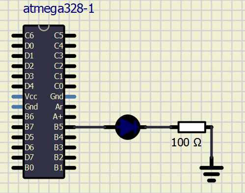
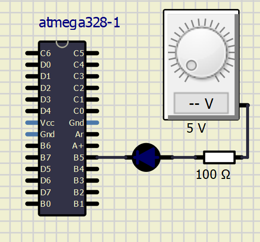
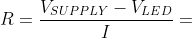
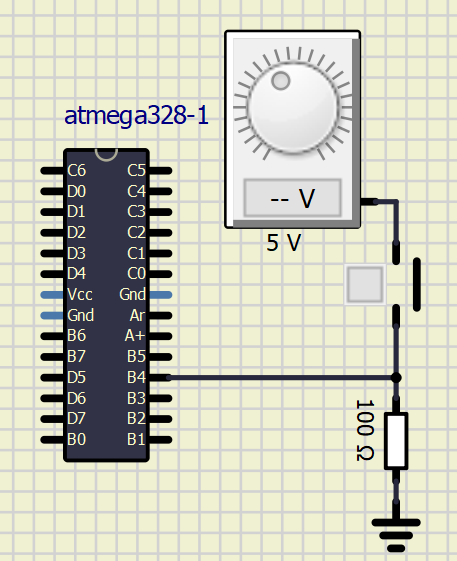
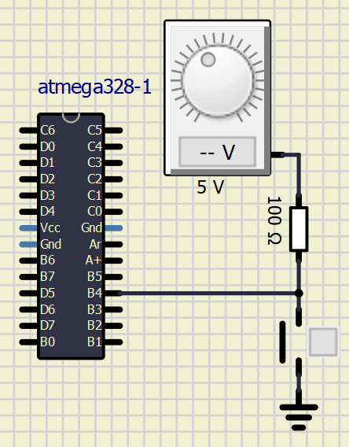

# Home Work
## LED

### LED active high

### LED active low

| **LED color** | **Supply voltage** | **LED current** | **LED voltage** | **Resistor value** |
| :-: | :-: | :-: | :-: | :-: |
| red | 5&nbsp;V | 20&nbsp;mA | 2 | 150 Ω |
| blue | 5&nbsp;V | 20&nbsp;mA | 4 | 50 Ω |

## Push Button

### PB active high

### PB active low

